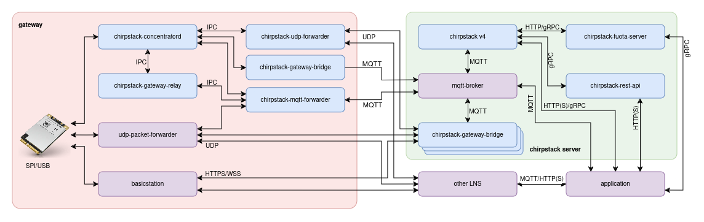

# ChirpStack Concentratord service for Docker

This is an **unofficial** built of the ChirpStack Concentratord service meant to be deployed using docker. The binaries included with this image are built using the concentratord fork under https://github.com/xoseperez/chirpstack-concentratord and may have small differences with the original binaries (check the repo for more info).

Please refer to the original sources of the project whenever possible, contribute and donate to Orne for his great work: https://github.com/chirpstack/chirpstack-concentratord

ChirpStack Concentratord is an open-source LoRa(WAN) concentrator daemon, part of the ChirpStack project. It requires other components in order to build a viable LoRaWAN solution. Either a chirpstack-gateway-bridge, a chirpstack-gateway-relay, a chirpstack-udp-forwarder or a chirpstack-mqtt-forwarder plus a LNS solution like ChirpStack LNS.

## Chirpstack Concentratord Service Variables

These variables you can set them under the `environment` tag in the `docker-compose.yml` file or using an environment file (with the `env_file` tag). 

Variable Name | Value | Description | Default
------------ | ------------- | ------------- | -------------
**`DEBUG`** | `STRING` | Set concentratord debug level (TRACE, DEBUG, INFO*, WARN, ERROR, OFF) | `INFO`
**`MODEL`** | `STRING` | Concentrator model. Required. See list below | 
**`INTERFACE`** | `SPI` or `USB` | Concentrator interface. `USB` only supported for SX1302/3 devices | Defaults to `SPI`
**`RESET_GPIO`** | `INT` | Reset GPIO for SPI SX1301/2/3 devices | `17`
**`POWER_EN_GPIO`** | `INT` | Power enable GPIO for SPI SX1302 devices | `0` (no power enable GPIO)
**`HAS_GPS`** | `0` or `1` | Set if concentrator has built-in GPS | some models have it enabled by default
**`REGION`** | `STRING` | Select the region (not needed for 2G4 concentrators) | `EU868`
**`CHANNELS`** | `STRING` | Select the channels (some regions have more than one channel set) | `EU868`
**`SOCKET_NAME`** | `STRING` | IPC socket prefix to use to communicate with other services | `concentratord`

## Use

Check the included `docker-compose.yml` file for a usage example.

## Supported models

The `MODEL` must be set to one of the supported concentrators in the list below:

* dragino_pg1302
* imst_ic880a
* kerlink_ifemtocell
* multitech_mtac_003e00
* multitech_mtac_003u00
* multitech_mtac_lora_2g4 
* multitech_mtac_lora_h_868
* multitech_mtac_lora_h_915 
* multitech_mtcap_lora_868
* multitech_mtcap_lora_915
* pi_supply_lora_gateway_hat
* rak_2245 
* rak_2246
* rak_2247
* rak_2287 
* rak_5146
* rak_5148 
* risinghf_rhf0m301
* sandbox_lorago_port
* seeed_wm1302
* semtech_sx1302c490gw1
* semtech_sx1302c868gw1 
* semtech_sx1302c915gw1
* semtech_sx1302css868gw1
* semtech_sx1302css915gw1 
* semtech_sx1302css923gw1
* semtech_sx1280z3dsfgw1  
* waveshare_sx1302_lorawan_gateway_hat
* wifx_lorix_one 

## License

ChirpStack Concentratord is distributed under the MIT license (and so is this repository). See LICENSE.

